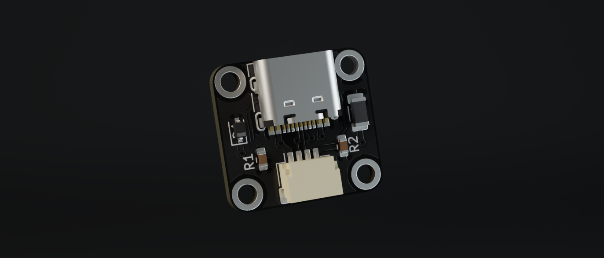
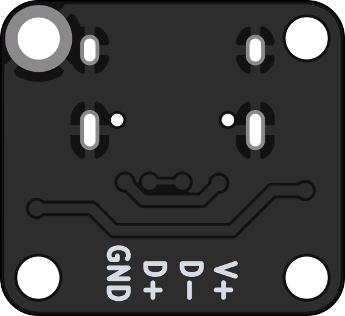

# Simple Daughterboard

[![CC BY-NC-SA 4.0][cc-by-nc-sa-shield]][cc-by-nc-sa]

### Simple USB-C daughterboard

This daughterboard features minimal electronics required for breaking out the VBUS, data and ground lines from a USB type C port.  
It features a basic USB shielding circuit but has no ESD protection or fuse built in.

Fuse and (optional) ESD protection should be added on the main PCB if you want to use this daughterboard for your project.

Since the single PCB alone is too small for SMT assembly from JLCPCB and automatic panel assembly is currently not possible with them I created a 2x2 panelized version that works with JLCPCB assembly. You can find it in the fab files (linked below).

---

[Panelized PCB](fab/sDB_panel.kicad_pcb)

[Gerbers](fab/gerbers.zip)

[LCSC BOM](fab/bom.csv)

[JLC CPL](fab/pos.csv)

[USB connector](https://lcsc.com/product-detail/USB-Type-C_Korean-Hroparts-Elec-TYPE-C-31-M-12_C165948.html)

[JST connector](https://www.digikey.com/product-detail/en/jst-sales-america-inc/SM04B-SRSS-TB-LF-SN/455-1804-1-ND/926875)

---

 

This work is licensed under a
[Creative Commons Attribution-NonCommercial-ShareAlike 4.0 International License][cc-by-nc-sa].

[![CC BY-NC-SA 4.0][cc-by-nc-sa-image]][cc-by-nc-sa]

[cc-by-nc-sa]: http://creativecommons.org/licenses/by-nc-sa/4.0/
[cc-by-nc-sa-image]: https://licensebuttons.net/l/by-nc-sa/4.0/88x31.png
[cc-by-nc-sa-shield]: https://img.shields.io/badge/License-CC%20BY--NC--SA%204.0-lightgrey.svg
